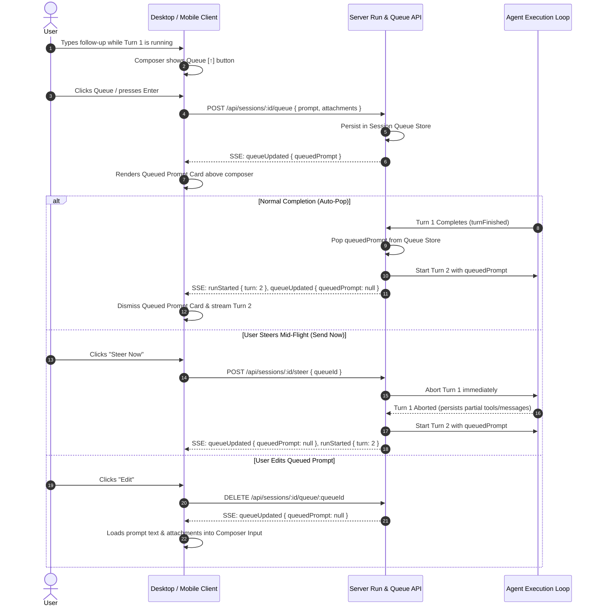

# Prompt Queueing & Steering Specification

**Status**: Draft  
**Applies to**: Desktop (`apps/desktop`), Mobile (`apps/mobile`), Server API (`apps/server`)  
**Target Capabilities**: Real-Time Agent Collaboration, Turn Orchestration, Mid-Flight Steering

> [!IMPORTANT]
> **Addendum (2026-09-09)**: A pre-implementation review against the current codebase found several places where this spec's data flow does not match how `RunService`, `AgentSessionEvent`, and `ComposerRunState` actually work today. Section 9 records the concrete resolutions; treat it as normative alongside sections 3–4 wherever they conflict.

---

## 1. Overview & Problem Statement

When an AI agent is executing a turn (researching, editing files, running commands), users frequently think of follow-up requests, refinements, or course corrections.

Currently:
1. When an agent is running, the composer action button shows **Stop** (`■`).
2. If the user types into the composer during a run, they cannot easily queue the message to run automatically once the agent finishes.
3. If the user realizes the agent took the wrong approach, they must manually click Stop, wait for termination, and then send a new prompt.

### Goals
- **Seamless Prompt Queueing**: Allow users to type and submit a follow-up prompt while a turn is active. The prompt is staged in a dedicated **Queued Prompt Card** directly above the composer.
- **Auto-Execution**: Once the active turn finishes successfully, the queued prompt is automatically dispatched as the next turn without requiring user intervention.
- **Three Core Queued Actions**:
  1. **Edit**: Pulls the queued prompt text and attachments back down into the composer input for editing (removing it from the queue).
  2. **Delete**: Discards the queued prompt completely.
  3. **Steer / Send Now**: Immediately halts the current turn and dispatches the queued prompt right away, steering the agent with the new instructions.
- **Multi-Device Synchronization**: Queued state is persisted on the backend and broadcast via SSE so Desktop and Mobile clients stay synchronized in real time.

---

## 2. User Experience & Visual Design

```
+-----------------------------------------------------------------------+
|  Agent Transcript / Tool Runs (Active Turn)                           |
|  ...                                                                  |
|  [Tool: editFile src/app.tsx] -> Success                              |
+-----------------------------------------------------------------------+
|                                                                       |
|  +-----------------------------------------------------------------+  |
|  | ⏳ "Also make sure to update the unit tests in app.test.tx..."  |  |
|  |                                              [✏️] [🗑️] [⚡ Steer] |  |
|  +-----------------------------------------------------------------+  |
|                                                                       |
|  +-----------------------------------------------------------------+  |
|  | (+) Message...                                [Claude 3.7 ⌵] [↑] |  |
|  +-----------------------------------------------------------------+  |
|  ⑂ main   📁 project-name ⌵                          🔒 Always Ask ⌵ |
+-----------------------------------------------------------------------+
```

### 2.1 Composer Button Dynamic States

| State | Composer Content | Agent Status | Action Button Rendered | Action on Click | Keyboard Shortcut |
|---|---|---|---|---|---|
| **Idle Ready** | Empty | Idle | Arrow Up (dimmed) | Disabled | - |
| **Idle Ready** | Non-empty | Idle | Arrow Up (active) | Run new turn | `Enter` |
| **Running** | Empty | Running | Stop Button (`■`) | Abort active turn | `Esc` / `⌘.` |
| **Running** | Non-empty | Running | **Queue Button (`↑`)** | **Queue prompt** | `Enter` |
| **Queued + Running** | Non-empty | Running | Disabled / Replace Queue | Update queue | `Enter` |

> [!NOTE]
> When the composer is empty during a run, the primary button is **Stop** (`■`). As soon as the user begins typing a follow-up, the button transitions into a **Queue** button (`↑`). If the user deletes their text, it smoothly reverts to the **Stop** button.

### 2.2 The Queued Prompt Card (Single Compact Row)

The Queued Prompt Card is an ultra-compact, single-line strip (`h(32px)`, `rounded(8px)`, `bg(theme.composer)` / `border_strong`) docked directly above the composer input:

- **Left Content (Single Truncated Line)**:
  - Subtle `⏳` icon or `Queued:` label.
  - The prompt text truncated with ellipsis (`truncate()`) before reaching the action buttons on the right.
- **Right Action Buttons (3 Compact Controls)**:
  1. **Edit (`✏️`)**: Clears the queue from the server and restores the prompt text & attachments into the active composer input.
  2. **Delete (`🗑️` / `✕`)**: Discards the queued prompt completely.
  3. **Steer / Send Now (`⚡` / `↑`)**: Halts the active agent turn immediately and starts this queued prompt as the new turn.

---

## 3. Architecture & Data Flow



---

## 4. Backend Server Specification (`apps/server`)

### 4.1 Data Model

```typescript
export interface QueuedPrompt {
  id: string;
  sessionId: string;
  prompt: string;
  attachments?: ImageAttachment[];
  modelId?: string;
  provider?: string;
  approvalMode?: string;
  createdAt: string; // ISO timestamp
}
```

### 4.2 REST Endpoints

#### `POST /api/sessions/:id/queue`
Adds or replaces the queued prompt for the session.
- **Request Body**: `RunPromptDto`
- **Response**: `{ success: true, data: QueuedPrompt }`
- **Emits Event**: `queueUpdated` over SSE.

#### `GET /api/sessions/:id/queue`
Fetches the current queued prompt for the session (if any).
- **Response**: `{ success: true, data: QueuedPrompt | null }`

#### `DELETE /api/sessions/:id/queue/:queueId`
Deletes a queued prompt.
- **Response**: `{ success: true, data: { deleted: true } }`
- **Emits Event**: `queueUpdated` with `null`.

#### `POST /api/sessions/:id/steer`
Halts the active run and immediately starts the specified queued prompt (or incoming prompt) as a new turn.
- **Request Body**: `{ queueId?: string, prompt?: string, attachments?: ImageAttachment[] }`
- **Response**: `{ success: true, data: { steered: true } }`
- **Behavior**:
  1. Calls `runService.abortRun(sessionId)`.
  2. Awaits current step cancellation and DB flush.
  3. Immediately invokes `runService.runAgentStream(sessionId, nextPrompt)`.

### 4.3 SSE Event Stream Extensions

The server's real-time event stream (`/api/sessions/:id/run/stream`) emits:

```typescript
export type AgentSessionEvent =
  | { type: "queueUpdated"; data: { queuedPrompt: QueuedPrompt | null } }
  | { type: "turnStarted"; data: { turnId: string; prompt: string } }
  | { type: "turnFinished"; data: { turnId: string; status: "completed" | "aborted" | "error" } }
  // ... existing events (textDelta, toolCall, toolResult, etc.)
```

---

## 5. Desktop Implementation (`apps/desktop`)

### 5.1 Component Structure

1. **`QueuedPromptCard`** (`crates/console-ui/src/common/queued_prompt_card.rs`):
   - Standalone GPUI component rendered above `ComposerView`.
   - Props:
     - `queued_prompt: Option<QueuedPrompt>`
     - `on_edit: Rc<dyn Fn(&mut Window, &mut App)>`
     - `on_delete: Rc<dyn Fn(&mut Window, &mut App)>`
     - `on_steer: Rc<dyn Fn(&mut Window, &mut App)>`
2. **`ComposerView` Updates** (`crates/console-ui/src/common/composer_view.rs`):
   - When `run_state.is_running()`:
     - If `composer_input` has text: action button renders as `↑ Queue` (`btn-queue-follow-up`).
     - If `composer_input` is empty: action button renders as `■ Stop` (`btn-abort-prompt`).
3. **State Management** (`apps/desktop/src/state/`):
   - Store `queued_prompts: HashMap<String, Option<QueuedPrompt>>` keyed by `session_id`.
   - On `ComposerEvent::Submit` when running: trigger `this.queue_prompt_for_session(sid, prompt, attachments, cx)`.

---

## 6. Mobile Implementation (`apps/mobile`)

### 6.1 UI & UX Flow

1. **Floating Capsule with Queued Banner**:
   - `QueuedPromptBanner` renders directly above the bottom chat input bar when `session.queuedPrompt` is present.
   - Smooth animated slide-up entry and exit using `react-native-reanimated`.
2. **Mobile Composer Actions**:
   - When turn is running and input field is focused with text: Send icon changes to a blue Queue badge (`↑`).
   - Tapping Queue adds the prompt and clears the input without interrupting the run.
3. **Card Actions**:
   - **Edit**: Tapping the card or edit icon restores the text to the `TextInput` and focuses keyboard.
   - **Trash**: Discards the queue.
   - **Steer / Send Now**: Instant button with confirmation haptic to interrupt and re-route the agent.

---

## 7. Edge Cases & Safety Invariants

1. **Run Errors / Tool Failures**:
   - If Turn 1 encounters an error or requires manual permission that gets rejected:
     - Policy: The queue is **held** (not discarded). The user can either click Steer to proceed or Edit to adjust.
2. **Session Switching**:
   - Queued state is strictly scoped per `sessionId`. Switching between tabs or sessions shows the corresponding session's queue.
3. **Client Disconnection / Reconnection**:
   - Because the queue is held in the server's Session Manager, restarting the desktop app or reloading mobile reconnects to the active run and pulls the current queued prompt via `GET /api/sessions/:id/queue`.
4. **Race Conditions on Auto-Pop**:
   - Server handles turn transition atomically: `runService` pops the queue inside a mutex/lock to prevent double execution if a client sends a steer request at the exact millisecond the turn settles.

---

## 8. Summary of Tasks for Implementation

- [ ] **Server (`apps/server`)**:
  - Implement `SessionQueueService` and persistence in `RunService`.
  - Add REST endpoints (`/queue`, `/steer`).
  - Emit `queueUpdated` event over SSE and handle auto-pop on turn settle.
- [ ] **Desktop (`apps/desktop`)**:
  - Build `QueuedPromptCard` component in `console-ui`.
  - Update `ComposerView` action button logic.
  - Wire queue, edit, delete, and steer actions to client RPC.
- [ ] **Mobile (`apps/mobile`)**:
  - Build `QueuedPromptBanner` with Reanimated animations.
  - Connect to queue/steer REST endpoints and SSE stream handler.

---

## 9. Addendum: Codebase Reconciliation

This section resolves conflicts found between sections 2–8 above and the current implementation of `apps/server`, `packages/types`, and `apps/desktop`. Implementers should follow this section where it overrides earlier text.

### 9.1 Event Types — Extend the Real Union, Don't Invent a New One

`AgentSessionEvent` is defined once in `packages/types/src/events.ts` and hand-mirrored in `apps/desktop/crates/console-core/src/types/events.rs`. It does **not** currently have `queueUpdated`, `runStarted`, or `turnFinished` — the existing lifecycle events are `turnStart`, `turnEnd`, and the synthetic re-attach frames `done`/`aborted`/`streamReset`.

Resolution:
- Add exactly one new variant to the shared union: `{ type: "queueUpdated"; queuedPrompt: QueuedPrompt | null }`.
- Do **not** add `runStarted`/`turnFinished`; reuse the existing `turnStart { prompt }` event for the auto-popped or steered turn, and existing `done`/`aborted` synthetic frames to signal turn settlement. This avoids widening every exhaustive match over `AgentSessionEvent` (`apps/desktop/src/state/run.rs`, `apps/mobile/utils/chat-events.ts`, the Rust enum) for concepts that already exist.
- Any change to the TS union in `packages/types/src/events.ts` must be mirrored in `apps/desktop/crates/console-core/src/types/events.rs` in the same change; these two files are not auto-generated from one another.

### 9.2 Steering — Reuse `RunService`'s Existing Settle/Abort Invariant

`RunService.abortRun()` intentionally does **not** delete the session's `activeRuns` entry synchronously — that deletion happens only in `runAgentStreamInternal`'s `finally` block, specifically to prevent a second `runAgentStream` call from racing the first run's teardown (shared `RunEventHub`/session state).

The spec's steer flow ("await current step cancellation... immediately invoke `runAgentStream`") as a separate caller would violate that invariant. Resolution:
- Add a `pendingNextTurn: Map<sessionId, RunPromptDto>` slot to `RunService` (parallel to `activeRuns`).
- `POST /sessions/:id/steer` sets `pendingNextTurn`, calls the existing `abortRun(sessionId)`, and returns immediately — it does **not** call `runAgentStream` itself.
- `runAgentStreamInternal`'s existing `finally` block, right before it deletes the `activeRuns` entry, checks `pendingNextTurn` for the session. If present, it clears the slot and kicks off the next `runAgentStream` call (fire-and-forget, same as how the top-level HTTP handler invokes it) instead of finishing quietly.
- The normal auto-pop path (§3 "Normal Completion") uses the same `pendingNextTurn` mechanism, populated by `POST /sessions/:id/queue` instead of `/steer`. This means **queueing and steering share one queue slot and one drain path** — "steer" is simply "abort, then let the existing drain-on-settle logic run early." This removes the separate mutex/lock language in §7.4, which has no real analog in this single-threaded-per-session code; the `activeRuns` Map itself is already the lock.

### 9.3 Persistence — Match the `session-todos.ts` Pattern

§7.3 requires the queue to survive server restarts and client reconnects. In-memory-only storage (a plain `Map` on `RunService`) satisfies reconnect-while-server-stays-up but not restart. Resolution: persist `QueuedPrompt` the same way `session-todos.ts` persists todos — one row per session in SQLite via `sessionStorage`, mirrored into an in-memory map for fast access during a run, loaded on `GET /sessions/:id/queue` and on session load. `queueUpdated` broadcasts stay in-memory/SSE-only (no need to re-fetch from disk on every broadcast).

### 9.4 Composer State — Add a Field, Not a New Enum Variant

`ComposerRunState` in `apps/desktop/crates/console-ui/src/common/composer_view.rs` is `Ready | Preparing | Running`, and "queued" is not a run state — a queue can exist independently of whether text is currently in the composer. Resolution: thread a separate `has_queued_prompt: bool` (or `Option<QueuedPrompt>`) prop into `ComposerView` alongside `run_state`, and derive the button variant (Stop / Queue / Disabled-Replace) from the `(run_state, composer_input.is_empty(), has_queued_prompt)` triple per the table in §2.1, rather than adding a `Queued` variant to `ComposerRunState` itself.

### 9.5 Auto-Pop Failure and Attachment Re-Validation

Two cases §7 doesn't cover:
- If the auto-popped or steered turn fails to start (e.g., `catalogModel?.supportsImages === false` per the existing check in `run.service.ts`, or an unknown provider), the queue entry is **not** silently dropped: surface the failure as a normal turn-start error (`error` event + `needs_attention` session status, matching existing error handling in `runAgentStreamInternal`) and leave `pendingNextTurn` cleared so the user can retry manually. This is consistent with §7.1's "hold, don't discard" policy but clarifies the auto-pop case specifically.
- Image attachments on a queued prompt are re-validated against the resolved model at drain time (not at queue time), since the model/provider active when the next turn actually starts may differ from when the prompt was queued.
